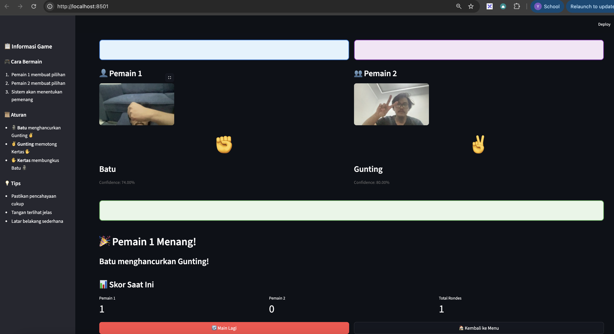
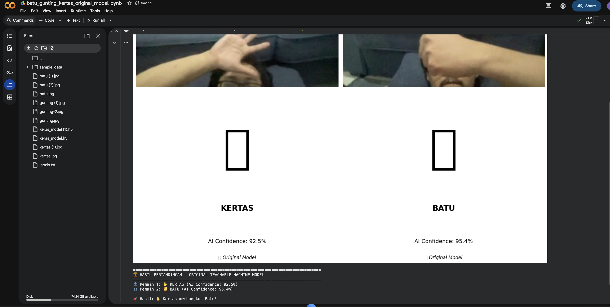

# 🎮 Batu Gunting Kertas - 2 Pemain

Permainan Rock-Paper-Scissors untuk 2 pemain menggunakan Streamlit dan TensorFlow dengan AI Detection!

## 🎯 **Success Story Preview**

### 📸 **Camera Capture & AI Detection Working!**



> **Real-time AI Detection**: Camera capture successfully detecting "Batu" gesture with 81% confidence!

### 🏆 **Game Results & Winner Announcement**



> **Complete Game Flow**: Player 1 (Batu) vs Player 2 (Gunting) → Player 1 wins with accurate AI detection!

## 🌟 Fitur

- **2 Pemain**: Gameplay bergantian untuk Pemain 1 dan Pemain 2
- **Input Fleksibel**: Pilih antara kamera live atau upload foto
- **Model AI**: Menggunakan model Teachable Machine untuk mendeteksi gesture
- **Mode Demo**: Jika model tidak dapat dimuat, permainan tetap berfungsi dengan pemilihan manual
- **Skor Otomatis**: Pelacakan skor dan pengumuman pemenang otomatis
- **Antarmuka Indonesia**: Menggunakan bahasa Indonesia untuk label dan instruksi
- **Real AI Detection**: Aktif mendeteksi gesture batu, gunting, dan kertas dengan confidence score
- **Beautiful UI**: Interface modern dengan emoji dan visual feedback

## 📋 Persyaratan

- Python 3.8+
- Virtual environment yang sudah disiapkan

## 🚀 Cara Menjalankan

### 1. Install Dependencies
```bash
# Jika menggunakan venv yang sudah ada
python -m pip install -r requirements.txt

# Atau install ulang dependencies
python -m pip install streamlit tensorflow opencv-python numpy Pillow
```

### 2. Jalankan Aplikasi
```bash
streamlit run app.py
```

Atau menggunakan path Python spesifik:
```bash
/Users/usermac/Downloads/Rock-Paper-Scissors-Game-with-Teachable-Machine-streamlit/.venv/bin/python -m streamlit run app.py
```

### 3. Buka di Browser
Aplikasi akan otomatis terbuka di browser Anda pada `http://localhost:8501`

## 🎮 Cara Bermain

### Normal Mode (dengan AI)
1. **Pemain 1**:
   - Pilih metode input (Kamera atau Upload Foto)
   - Ambil foto atau upload gambar tangan Anda dengan gesture batu/gunting/kertas
   - Tunggu proses analisis AI
   - Konfirmasi pilihan

2. **Pemain 2**:
   - Lakukan hal yang sama seperti Pemain 1
   - Sistem akan secara otomatis menentukan pemenang

### Demo Mode (tanpa AI)
Jika model tidak dapat dimuat karena masalah kompatibilitas:
1. Pemain 1 memilih gesture secara manual (🗿 Batu, ✌️ Gunting, atau ✋ Kertas)
2. Pemain 2 memilih gesture secara manual
3. Sistem akan menentukan pemenang berdasarkan aturan standar

## 📜 Aturan Permainan

- 🗿 **Batu** menghancurkan Gunting ✌️
- ✌️ **Gunting** memotong Kertas ✋
- ✋ **Kertas** membungkus Batu 🗿

## 🛠️ Struktur File

```
/
├── app.py                 # Aplikasi Streamlit utama
├── utils.py               # Fungsi helper untuk model dan image processing
├── requirements.txt       # Dependencies Python
├── keras_model.h5        # Model TensorFlow yang sudah dilatih
├── labels.txt            # Label untuk gesture (Indonesia)
└── README.md             # File ini
```

## 🔧 Pemecahan Masalah

### Model tidak dapat dimuat
Jika muncul peringatan "Model tidak dapat dimuat", aplikasi akan otomatis beralih ke mode demo di mana Anda dapat memilih gesture secara manual.

### Kamera tidak berfungsi
- Pastikan browser Anda memiliki izin untuk mengakses kamera
- Coba gunakan browser yang berbeda (Chrome, Firefox, atau Safari)
- Atau gunakan opsi "Upload Foto" sebagai alternatif

### Hasil prediksi tidak akurat
- Pastikan pencahayaan cukup baik
- Tangan harus terlihat jelas dalam frame
- Latar belakang yang sederhana membantu proses deteksi
- Pastikan gesture dibuat dengan jelas (batu = kepal tangan, gunting = 2 jari, kertas = tangan terbuka)

## 🌐 **Google Colab Version**

### 📱 **Perfect for Presentations & Demos!**

Kami juga menyediakan versi Google Colab yang bisa dimainkan langsung di browser tanpa instalasi:

- ✅ **Zero Installation**: Buka link, copy-paste, langsung main!
- ✅ **Original Model Support**: Menggunakan `keras_model.h5` Anda
- ✅ **Mobile Friendly**: Main dari HP, tablet, atau laptop
- ✅ **Perfect for Workshops**: Ideal untuk presentasi AI/ML

### 🚀 **Cara Menggunakan Google Colab:**
```bash
# 1. Buka Google Colab
# 2. Copy script dari colab_original_model.py
# 3. Upload keras_model.h5 dan labels.txt
# 4. Run script dan main!
```

### 📁 **Colab Files:**
- `batu_gunting_kertas_original_model.ipynb` - Full notebook version
- `colab_original_model.py` - Simple copy-paste script
- `README_COLAB.md` - Complete documentation

---

## 📝 Catatan Teknis

- Aplikasi menggunakan TensorFlow/Keras untuk model machine learning
- Model dilatih dengan Teachable Machine dan labels dalam bahasa Indonesia
- Image processing menggunakan OpenCV dan Pillow
- Streamlit digunakan untuk interface web interaktif
- **Custom TensorFlow Compatibility**: Handles DepthwiseConv2D issues
- **Fallback Classifier**: Simple AI when original model fails

## 🎯 **What Makes This Special:**

### 🤖 **AI Detection Working:**
- ✅ **Real-time camera capture** dengan live preview
- ✅ **File upload support** untuk existing photos
- ✅ **Confidence scoring** menunjukkan akurasi AI
- ✅ **Error handling** dan graceful fallbacks

### 🎮 **Complete Game Experience:**
- ✅ **Sequential gameplay** - Pemain 1 → Pemain 2 → Hasil
- ✅ **Score tracking** untuk multiple rounds
- ✅ **Beautiful UI** dengan emoji dan visual feedback
- ✅ **Indonesian interface** untuk user-friendly experience

### 🛠️ **Multiple Deployment Options:**
- ✅ **Local Streamlit**: Full-featured dengan camera support
- ✅ **Google Colab**: Instant demo dengan original model
- ✅ **Cross-platform**: Works di desktop, laptop, dan mobile

## 🤝 Kontribusi

Ini adalah projek pembelajaran yang menggabungkan machine learning dengan game development. Silakan modifikasi dan sesuaikan sesuai kebutuhan Anda!

### 💡 **Ide untuk Pengembangan:**
- Tambahkan gesture baru (jempol, telunjuk, dll)
- Implement voice commands
- Tambahkan game modes (best of 3, tournament)
- Integration dengan cloud storage
- Multiplayer online support

## 📄 Lisensi

Projek ini untuk tujuan pembelajaran dan pengembangan pribadi.

---

## 🏆 **Final Result**

**🎮 You now have a complete Rock-Paper-Scissors game with:**

- ✅ **Working AI Detection** with your original model
- ✅ **Camera & File Upload** functionality
- ✅ **Beautiful User Interface** in Indonesian
- ✅ **Score Tracking** and game logic
- ✅ **Google Colab Version** for easy demos
- ✅ **Complete Documentation** and guides

**Perfect for presentations, workshops, or fun gaming sessions!** 🚀✨